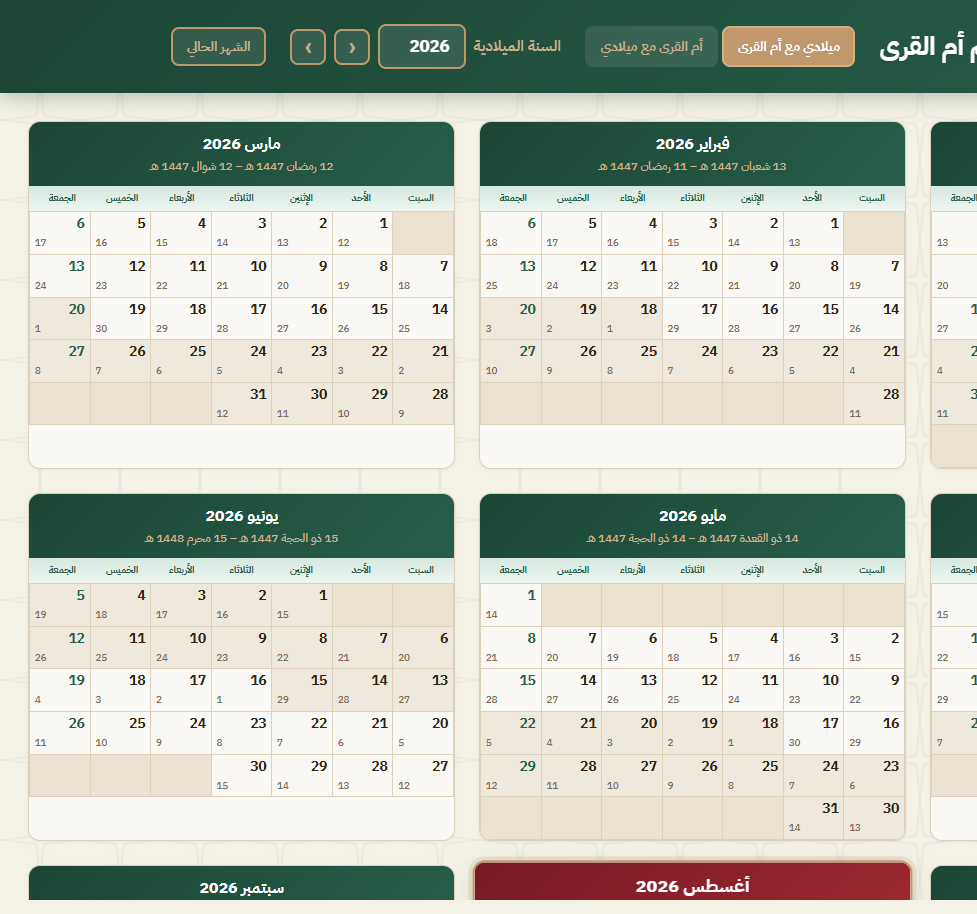
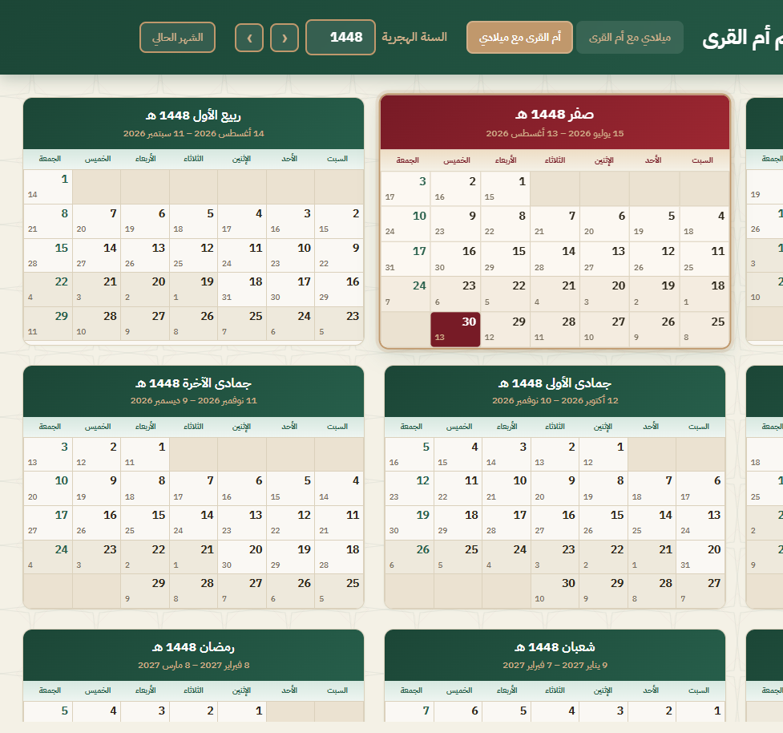

# التقويم الميلادي وتقويم أم القرى

**Gregorian & Umm al-Qura Calendar**

[](https://sherif-hfm.github.io/calendar/)
[](https://sherif-hfm.github.io/calendar/)
[](https://sherif-hfm.github.io/calendar/)
[](https://sherif-hfm.github.io/calendar/)

A static Arabic calendar that shows **Gregorian** and **Umm al-Qura (Hijri)** dates together for a full year. Switch which calendar is primary, browse years, and jump to the current month.

**[Open the live demo](https://sherif-hfm.github.io/calendar/)**



## Features

- **Two views** — Gregorian with Umm al-Qura, or Umm al-Qura with Gregorian. Each day cell shows both dates; the primary calendar is larger.
- **Official Hijri calendar** — dates use the browser’s Umm al-Qura calendar (`islamic-umalqura`), the system used in Saudi Arabia.
- **Year navigation** — type a year or step with arrows. Gregorian years: 1900–2100. Hijri years: 1350–1500 هـ.
- **Current month** — the current month is highlighted; one click scrolls to it.
- **Today** — today’s cell is marked in maroon. Hover any day for the full date in both calendars.
- **Arabic RTL layout** — week starts on Saturday. Fridays are tinted green.
- **No backend** — open the HTML file or serve the folder. Nothing to install besides a browser.

## Umm al-Qura view

Hijri months become the cards; Gregorian dates sit in the corner of each cell.



## Quick start

Open `index.html` in a browser, or serve the folder:

```bash
npx --yes serve .
```

Then open the URL printed in the terminal (usually http://localhost:3000).

## How dates are calculated

Gregorian dates come from the JavaScript `Date` object. Hijri dates come from `Intl.DateTimeFormat` with the `islamic-umalqura` calendar.

For the Hijri-year view, the app first estimates each month start with a tabular (Kuwaiti) Hijri conversion, then snaps that guess to the browser’s Umm al-Qura date (within ±3 days). Month lengths follow Umm al-Qura (29 or 30 days), not the tabular algorithm.

Umm al-Qura support depends on the browser. Current Chrome, Edge, Firefox, and Safari all implement it.

## Project layout

```
├── index.html      # Page structure (RTL Arabic)
├── styles.css      # Layout and theme
├── script.js       # Calendar rendering and conversion
└── assets/         # Background pattern and screenshots
```
